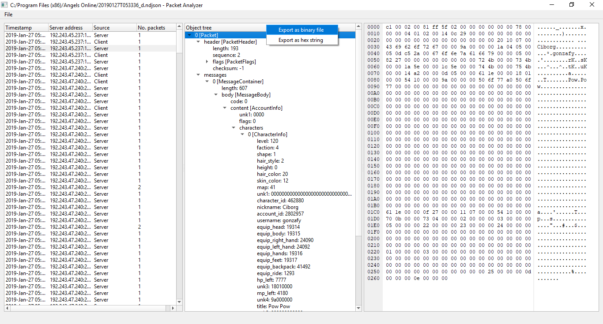

# Packet Analyzer v0.1.0

## Program

### Features

- Open decrypted packet logs
- Parse structures using kaitai description file
- Hex viewer
- Extract packet byte array as binary or hex file

## Setup
#####1- Download and install [Python 3.7.2](https://www.python.org/downloads/windows/)

Run the installer, check "Add python 3.7 to PATH" then clic "Install Now"

#####2- Add python site-packages folder to path environment variable
From the next string, replace \<User\> (with quotes) for your windows user.

`C:\Users\<User>\AppData\Local\Programs\Python\Python37-32\Lib\site-packages`

Then add to your "PATH" environment variable. If you dont know how to do that check [this guide](https://www.architectryan.com/2018/03/17/add-to-the-path-on-windows-10/)

#####3- Download dependences
This program depends on:

- kaitaistruct
- shiboken2
- PySide2

Installing dependences on python is very easy but because there is a bug on `PySide2` and its dependence `shiboken2`, cant be installed using pip command.

So from [qt website](https://download.qt.io/official_releases/QtForPython/pyside2/
) download:

- shiboken2-5.12.0-5.12.0-cp35.cp36.cp37-none-win32.whl
- PySide2-5.12.0-5.12.0-cp35.cp36.cp37-none-win32.whl

Now open the download folder in a console. Then run:

- `py -m pip install shiboken2-5.12.0-5.12.0-cp35.cp36.cp37-none-win32.whl`

- `py -m pip install PySide2-5.12.0-5.12.0-cp35.cp36.cp37-none-win32.whl`

Then install kaitaistruct running:

- `py -m pip install kaitaistruct`

#####4- You are ready to rock!

## Usage

To start using the program, put your kaitai descriptor file in the root of this project, at the same level of this readme.md file.

The descriptor file must be named "packet.ksy".

Then open a console into this folder and run:

`py -m packet_analyzer`

The descriptor file is parsed everytime the program starts.